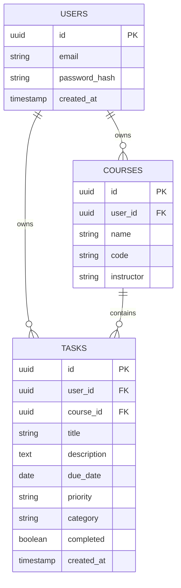

# Student Task Manager — Design Document (v1)

## 1. Architecture Overview
A monolithic server-rendered web application. Flask handles routing, business logic, and rendering; the browser receives complete HTML pages (no separate frontend API layer for v1).

```
Browser  <-- HTML (Jinja templates) -->  Flask App
                                            |
                                    SQLAlchemy ORM
                                            |
                                       PostgreSQL
```

## 2. Tech Stack
| Layer | Choice | Why |
|---|---|---|
| Backend framework | Flask | Existing hands-on experience (Khana-Tracker) |
| Templating | Jinja2 + Bootstrap | Server-rendered, fastest path to a working v1 |
| ORM | SQLAlchemy | Already used in prior project; maps cleanly to Flask |
| Database | PostgreSQL | Persists properly on hosting platforms (unlike SQLite), supports concurrent users |
| Auth | Flask-Login | Standard session-based auth for Flask |
| Email | Flask-Mail | Sends deadline reminder emails |
| Migrations | Flask-Migrate (Alembic) | Version-controlled schema changes as the app evolves |

## 3. Folder Structure
```
student-task-manager/
├── app/
│   ├── __init__.py
│   ├── models/        # user.py, course.py, task.py
│   ├── routes/         # auth.py, courses.py, tasks.py, dashboard.py
│   ├── services/       # task_service.py, email_service.py
│   ├── templates/
│   ├── static/
│   └── config.py
├── migrations/
├── tests/
├── docs/                # requirements.md, design.md (this file)
├── .env
├── .gitignore
├── requirements.txt
└── run.py
```

## 4. Database Schema (ER Diagram)



**Design notes**:
- `Task` stores both `user_id` and `course_id` (denormalized) so a user's full task list can be queried without joining through Courses.
- `priority` and `category` are plain strings in v1; can be migrated to Enum types later.
- Passwords are always stored as `password_hash`, never plaintext (bcrypt via Flask-Login/Werkzeug).

## 5. Routes (Flask, server-rendered)

| Route | Method | Purpose |
|---|---|---|
| `/signup` | GET/POST | Create account |
| `/login` | GET/POST | Log in |
| `/logout` | POST | Log out |
| `/courses` | GET | List courses |
| `/courses/new` | GET/POST | Create course |
| `/courses/<id>/edit` | GET/POST | Edit course |
| `/courses/<id>/delete` | POST | Delete course |
| `/tasks` | GET | List/filter tasks |
| `/tasks/new` | GET/POST | Create task |
| `/tasks/<id>/edit` | GET/POST | Edit task |
| `/tasks/<id>/toggle` | POST | Toggle complete/incomplete |
| `/tasks/<id>/delete` | POST | Delete task |
| `/dashboard` | GET | Today / overdue / upcoming-7-days view |

## 6. Notes
- Tech stack and schema may evolve as implementation proceeds — this document should be updated alongside code changes, not just written once.
- v2 candidate: split into a Flask REST API + React frontend, reusing this same schema.
